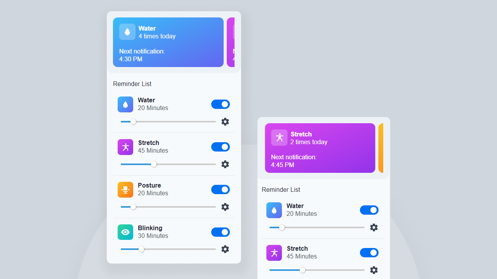

# rminder

This extension will notify you to drink water, correct your posture, blink, and stretch. Because we often forget to do all that when browsing, and it will affect your health.
You can customize the interval of when you want to notify and the text of the notification, you also can turn off the notification.

## Build Setup

```bash
# install dependencies
$ yarn install

# build for development
$ yarn serve

# build for production and launch server
$ yarn build

```
